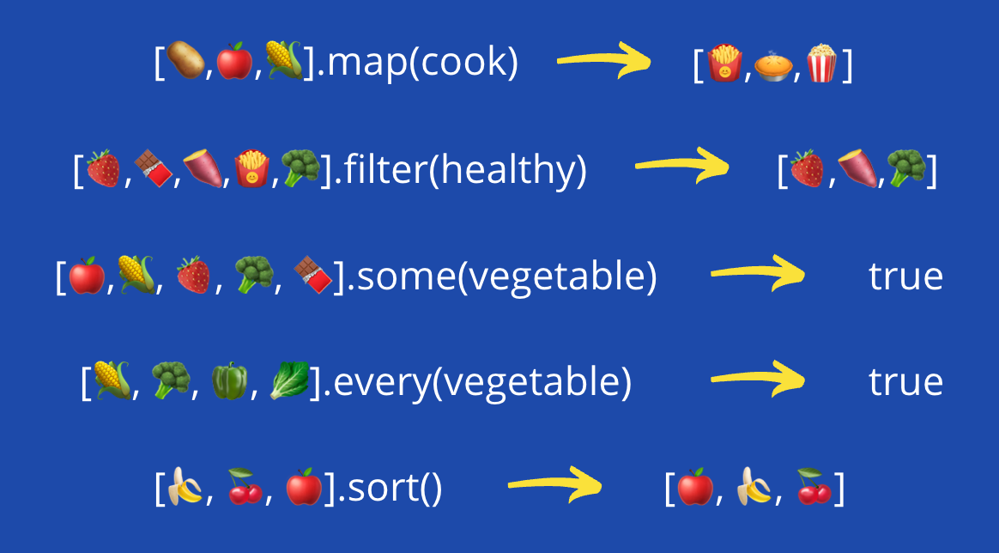

# ARRAY METHODS AND CALLBACKS

Welcome to our workshop on harnessing the power of array methods and callbacks in JavaScript! Array methods are handy tools in JavaScript for working with array data.

These methods allow you to loop through an array and perform an action on each element. To customize the action, you pass a callback function as an argument. A callback is just a function that gets passed in and called by another function. 

For example:

```js
//Initialise Array 
const numbersArray = [2,3,4,5,6]

// add one to each value 
numbersArray.map(function(element) {
  return element + 1;
});

// Filter for positive numbers
numbersArray.filter(function(element) {
  return element > 0; 
});
```

By the end, you'll have a solid grasp of array methods and callbacks to write more functional JavaScript. Get ready to level up your array skills 💪

## 💡 OBJECTIVES FOR THE WORKSHOP

This workshop is all about _array methods & callbacks_! Here's a glimpse of what you'll be achieving by the end of this workshop:

- Be able to read and write functions that include callback functions
- Be able to manipulate arrays using some basic array methods

## 🎟️ TICKETS

Time to dive into action! 🏊🏼‍♀️ Here's what you'll be working on:

### 🎫 Ticket 1 - GETTING SET UP

**Tasks**:

1. Create a HTML file in this workshop folder
2. Paste the following code into your newly created HTML file and familiarise yourself with the code

```html
<!DOCTYPE html>
<html>
  <head>
    <title>Array Methods & Callbacks</title>
  </head>
  <body>
    <h1>Array Methods & Callbacks</h1>
    
  </body>
</html>
```

3. Create a CSS file in this workshop folder
4. Paste the following code into your newly created CSS file and familiarise yourself with the code

```css
body {
  text-align: center;
  text-transform: uppercase;
}

img {
  width: 60%;
  height: 60%;
  border-radius: 1%;
}
```

5. Link your CSS file to your HTML file
6. Create a JavaScript file in this workshop folder
7. Link your JS file to your HTML file
8. Write a basic console message in your JS file, such as 'Hello World'
9. Run your HTML file with LiveServer to open it up in the browser and check everything is working
10. Congratulate yourselves on a job well done 🎉

### 🎫 Ticket 2 - Callback Functions

Callback functions are functions that are passed as arguments to other functions. The functions that accept callback functions are called "higher order functions".

In this exercise, you'll practice creating and passing callback functions. 

### Tasks

1. **Create a greeting function**

   - Create a function that accepts a name parameter
   - It should log a greeting message using the name

2. **Create a higher order function**   

   - Create a function that accepts:
     - A callback function
     - Three name parameters
     - It should call the callback function (in this case, the greeting function we made), passing each name

3. **Call the higher order function**

   - Make sure to pass in:   
     - The callback function 
     - Three names
  - Check the result, is it what you expected?

### Resources  

- [Callback Functions in JavaScript](https://javascript.info/callbacks)
- [Higher Order Functions](https://eloquentjavascript.net/05_higher_order.html)


### 🎫 Ticket 3 - Intro to Array Methods

Array methods are very useful for transforming and manipulating arrays in JavaScript. 

These methods take in a callback function as an argument, which gets invoked on each element in the array during the execution of the method. 

The callback can be:

- An anonymous function defined inline, like `.map(x => x * 2)`
- A named function passed in, like `.map(multiplyByTwo(x))`

The key thing is that these array methods allow you to easily iterate through an array and perform an operation on each element by supplying a callback function.

In this exercise, you have a list of products with prices that need VAT added before displaying on a website. You will be using the .map() array method. The .map() array method allows you to transform array data by applying a callback function to each element. You can explore more information about .map(), in the resources provided below.

1. **Create a products array**  
   
   - Initialize an array to store the products and prices  
   - Each item should represent one product record (this can be stored as an object in the array)

   <br>
  ```js
    let productsArray = [
      {
        product: 'Shoes',
        price: 25
      },
      {
        product: 'Hat',
        price: 5
      }
    ]
   ```
<br>
2. **Use `.map()` to apply VAT**

   - Use `.map()` on the products array (see docs below)
   - For each product in the array, you want to update the price to include VAT (20%)
   - Store the array returned from the .map() method in a variable.  

3. **Check the results**

   - Check the original array was not mutated (see docs below)
   - Log the new array to verify VAT was added correctly
   
### Resources

- [MDN Web Docs on `.map()`](https://developer.mozilla.org/en-US/docs/Web/JavaScript/Reference/Global_Objects/Array/map)
- [W3Schools on Array Mutation](https://www.w3schools.com/js/js_array_mutation.asp)

### 🎫 Ticket 4 - Exploring More Array Methods

There are many built-in JavaScript array methods that allow you to transform and manipulate array data in different ways. 

In this exercise, you'll get hands-on practice with some commonly used methods like `.map()`, `.filter()`, `.reduce()`, and more!

## Tasks

1. **Transform an array with .map()**

   - Initialize an array of numbers  
   - Use .map() to double each number
      - ***It's up to you if you want to abstract that logic away into a seperate function or just have it in-line within an anonymous callback function inside of the .map()***
   
2. **Filter an array with .filter()**

   - Initialize an array of strings
   - Create a function that returns true if the length of the string is > 5 
   - Use .filter() to get strings longer than 5 characters
   
3. **Reduce an array with .reduce()**

   - Initialize an array of values
   - Use .reduce() to combine them into a single value
   
4. **Explore more array methods**

   - Check out methods like:

     - .concat()
     - .slice()
     - .splice()
     - .indexOf()
     - .includes()
     - .pop()

   - Try using some of them on test arrays
   
5. **Chain array methods together**

   - Chain multiple methods together like `.filter().map().reduce()`
   - Get creative with combining methods!
   
## Resources

- [JavaScript Array Method Reference](https://developer.mozilla.org/en-US/docs/Web/JavaScript/Reference/Global_Objects/Array#instance_methods) 
- [Array Method Examples](https://javascript.info/array-methods)

### 🎫 Ticket 5 - Deeper Understanding of Array Methods.

Array methods like `.map()`, `.filter()` and `.reduce()` are very useful in JavaScript as they abstract away a lot of looping logic for us. However, it's important to understand what these methods are doing under the hood. 

**In this ticket, your task is to re-implement some of the array method functionality by writing it yourself using basic `for` loops in JavaScript.**

**Tasks:**

1. Take some code you previously wrote that uses `.map()`, `.filter()` and/or `.reduce()`.

2. Re-write the same functionality using `for` loops instead. 

For example:

```js
// Original code with .map()
const numbers = [1, 2, 3, 4];
const doubled = numbers.map(n => n * 2);

// Re-written with for loop  
const doubled = [];
for (let i = 0; i < numbers.length; i++) {
  doubled.push(numbers[i] * 2);
}
```

***Really focus on what the array methods are abstracting away for you. Think about:***

 - Looping over the array
 - Applying a callback function to each element
 - Returning a new array with the transformed values

**The goal is to better understand how these handy methods work behind the scenes.**

### 🎫 Final Ticket - REAL-WORLD EXAMPLE: ADDRESS BOOK

Your company's database has gone down and your boss needs somewhere to store new contacts asap. As a temporary fix, you're going to create a simple address book using alerts and prompts as your main way to interact with your boss (the user). Don't be afraid to explore new array methods here if that's the direction this takes you in 😁

1. Firstly, initialise an address book array

_Adding contacts:_

2. Create a function for adding contacts. Things to consider:
  - How will you get (and store) a name from a user?
  - How will you get (and store) the phone number from a user?
  - How will you then add those contact details to the address book?
  - How can you check that these have successfully been added to the address book?

_Displaying all contacts:_

3. Create a function that will show all contacts

_Stretch goals:_

- Create a function for updating contacts
- Create a function for deleting contacts
- Create a function for searching contacts

🎉 Yes, folks! Well done for making it through another workshop 🎉
